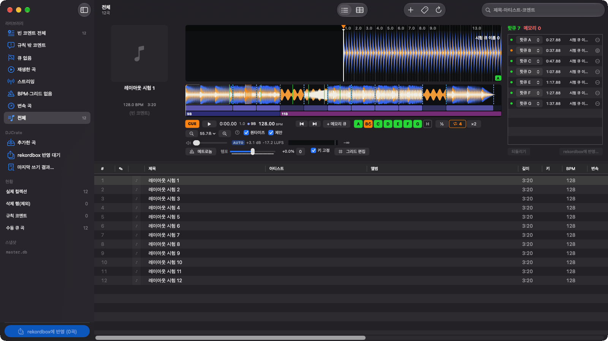

# DJCrate

[](https://github.com/fotoner/DJCrate/actions/workflows/check.yml)
[](LICENSE)

rekordbox 7 라이브러리를 관리하는 macOS 앱. 큐·그리드·오토게인을 고치고 곡을 넣고 빼는 일을 rekordbox를 켜지 않고 하며, 결과는 rekordbox 라이브러리에 직접 쓴다. 공연용 DJ 프로그램이 아니라 라이브러리 관리 도구다. 명령줄 도구 `djc`도 함께 있다.



화면은 macOS 언어 설정에 따라 한국어·영어·일본어로 나온다. English summary: [below](#english).

## 기능

- **곡 목록**: rekordbox 라이브러리를 사본으로 읽어 재생 목록 트리와 함께 본다. 큐 없음·BPM·그리드 없음·변속 곡·쓰기 대기 같은 필터, 컬럼 고르기(머리글 오른쪽 클릭), 곡 전체 미리 보기 파형 칸(기본은 숨김). 한 번 클릭은 곡을 고르기만 하고 덱은 그대로다. 더블클릭·⌘→·덱으로 끌어다 놓기·오른쪽 클릭 "덱에 불러오기"로 덱에 올린다(rekordbox와 같게). 덱에 올린 곡은 # 칸에 스피커로 보인다.
- **덱**: 3밴드 파형(확대·전체), CDJ식 CUE, 핫큐 A~H, 메모리 큐, 루프(즉석 루프·½·×2·활성 루프, 샘플 단위로 이어 되풀이), 퀀타이즈(Q: 큐·루프 등록을 박에 맞추고 재생 중 핫큐는 다음 큰 박선에서 저장 위치로 이동), 메트로놈, 템포·키 고정, 오토게인과 레벨 미터. 파형은 키보드(박·마디 이동, 제안 받기)와 VoiceOver(위치 값·1박 조절·큐·섹션·조성 변화 로터)로도 다룬다.
- **그리드 편집**: 이동, BPM 입력·×2·÷2, 여기를 1박으로, 변속 지점, 탭 템포. 그리드를 고칠 때 핫큐·메모리 큐·루프가 같은 박을 따라가게 할 수 있다.
- **분석과 제안**: 곡 구조로 메모리 큐 후보 제안, 그리드 없는 곡의 BPM·그리드 추정(변속 곡 포함), 조성 흐름(1A–12B), 음량(LUFS)·클리핑 흔적.
- **태그 편집**: 곡 목록에서 바로(고른 줄의 태그 칸을 한 번 더 누르고 잠깐 기다리기 또는 곡을 고르고 Return, Tab으로 옆 칸, 여러 곡을 고르면 모두에), 인스펙터, 엑셀식 태그 시트(복사·붙여넣기·아래로 채우기). 태그는 초안으로 두었다가 새 곡을 넣을 때, 그리고 이미 라이브러리에 있는 곡은 rekordbox에 쓰기(⇧⌘E) 때 rekordbox 곡 정보에 쓴다. 음원 파일의 태그는 바꾸지 않는다. rekordbox 실험으로 쓰기 규칙을 확인한 칸(제목·아티스트·장르·작곡가·연도·트랙 번호·코멘트)을 쓰고, 새 앨범·같은 앨범 아티스트의 유일한 기존 앨범으로 변경·앨범 비우기·이름이 유일하고 한 곡만 쓰는 앨범의 앨범 아티스트 변경도 조건부로 지원한다. 공유 앨범 아티스트 변경·동명 앨범 선택 등 아직 확인하지 않은 조건은 쓰기 미리 보기에서 이유와 함께 막는다([규칙](docs/rekordbox-internals.md#태그-곡-정보)).
- **rekordbox에 바로 쓰기**: 큐(메모리·핫큐·루프·활성 루프)·그리드·BPM·오토게인·태그(곡 정보)를 rekordbox 라이브러리에 쓴다. 쓰기 전에 무엇이 들어가고 무엇이 막히는지 미리 보여 주고, 쓴 뒤에는 되돌릴 수 있다.
- **재생 목록**: 사이드바에서 재생 목록·폴더를 만들고(새 항목은 부모 맨 위), 이름을 바꾸고(두 번 누르기), 지우고, 끌어서 옮긴다. 곡을 사이드바 목록에 끌어다 놓거나 오른쪽 클릭 "재생 목록에 넣기 ▸"(최근 목록·폴더 트리·찾아서 넣기), ⇧⌘P(마지막에 쓴 목록)로 넣고, 목록을 볼 때 ⌫로 빼거나 끌어서 순서를 바꾼다. 모두 초안으로 쌓였다가 rekordbox에 쓰기(⇧⌘E) 때 큐·그리드 초안과 함께 쓰고 쓰기 전으로 복원할 수 있다. 인텔리전트 재생 목록은 고치지 않는다.
- **iTunes 동기화 목록**: 새로고침 옆 **동기화** 버튼에서 폴더·플레이리스트를 고르면 rekordbox의 동기화 선택을 바꾸고 DJCrate에도 같은 결과를 표시한다. 선택 창은 전체 iTunes 목록과 반영할 목록을 나란히 보여 주며, 폴더 선택은 하위 목록도 포함한다. rekordbox를 종료한 상태에서 백업 후 반영하며, 창을 연 뒤 외부에서 선택이 바뀌었으면 덮어쓰지 않는다. rekordbox에서 바꾼 선택도 새로고침하거나 DJCrate로 돌아올 때 다시 읽는다. Framework·XML 읽기 설정, 폴더, 곡 순서, 같은 곡의 반복을 유지한다. 목록의 곡 구성은 Music에서 편집하고 기존 컬렉션에 연결된 곡의 큐·태그는 DJCrate에서 편집할 수 있다. 컬렉션에 없거나 경로가 모호한 곡은 누락 개수를 알린다. 갱신에 실패하면 이전 목록을 오래된 자료로 표시한다.
- **곡 넣기·빼기**: 음원 파일·폴더를 끌어다 놓으면 BPM·그리드를 추정하고, rekordbox를 켜지 않고 컬렉션에 넣는다(곡 행, 파형·그리드·오토게인 분석 파일, 태그, 큐). 목록에서 오른쪽 클릭으로 컬렉션에서 뺄 수도 있다(음원 파일은 그대로). 넣기·빼기도 되돌릴 수 있다. rekordbox XML(Import To Collection)로 넘길 수도 있다.
- **중복 곡 합치기**: 사이드바 ‘중복 후보’에서 같은 음원인지 미리 듣고 ‘이 곡을 남기고 합치기…’로 초안을 만든다. 메모리 큐·핫큐와 재생 목록 항목을 옮기고 나머지를 컬렉션에서 빼며, ⇧⌘E로 한 번에 반영하고 되돌린다. 핫큐·활성 루프 충돌, 음원 길이 차이 20ms 초과, 확인하지 않은 시간축·삭제 참조는 막는다. 재생 기록·평점 등 옮기지 않는 정보는 확인 창에 알린다. 음원 파일은 남긴다.
- **가져온 곡의 재생 목록**: 새 음원 파일·폴더를 사이드바 재생 목록에 놓으면 ‘추가한 곡’에 넣고, 컬렉션 등록 뒤 그 목록 초안에 연결한다. Apple Music XML 가져오기에서 ‘재생 목록도 만들기’를 켜면 선택한 곡의 소속 목록을 맨 위에 만든다. 같은 이름은 ‘ (2)’, ‘ (3)’을 붙여 새로 만들고, 같은 출처는 나눠 가져와도 원래 순서로 이어 넣는다(같은 파일은 한 번). 목록 초안은 다음 쓰기 때 쓴다.
- **곡 편집(시험 기능)**: 덱의 편집… 버튼(덱 › 곡 편집…)으로 마디 단위로 구간을 골라 순서를 바꾸고 늘리거나 줄인 편집본을 WAV로 렌더한다(`~/Music/DJCrate 편집본`). 이음새 앞뒤를 미리 듣고, 그리드·큐는 편집 위치로 옮겨 새 곡으로 "추가한 곡"에 넣는다. 원곡은 그대로다. 템포 구간이 하나인 곡만 된다.
- **분석 전 곡**: rekordbox에서 분석하지 않은 곡은 그리드를 쓸 때 파형·그리드·오토게인 분석 파일을 만들어 붙인다.
- **편집은 초안으로**: 모든 편집은 DJCrate 초안으로 쌓이고 쓰기 전까지 rekordbox는 그대로다. 큐·그리드·게인·태그 편집은 ⌘Z로 되돌린다.
- **코멘트 프리셋(선택 기능)**: 기본은 꺼짐. 설정 › 일반에서 애니송을 고르면 코멘트 분류·필터·현황·형식 검사를 켠다. CLI의 `parse`는 애니송 전용이며 `report`·`search`는 `--comment-preset anisong`으로 명시한다.
- **설정(⌘,)**: 일반·덱·단축키. 덱 단축키를 원하는 키로 바꿀 수 있다.
- **명령줄·AI 에이전트**: `djc`로 라이브러리를 찾아보고 큐·태그 초안을 만든다. Claude Code·Codex용 스킬이 들어 있다([아래](#명령줄과-ai-에이전트)).

## 안전 장치

- rekordbox(또는 rekordboxAgent)가 켜져 있으면 쓰지 않는다.
- 쓰기 규칙을 확인한 rekordbox 버전(7.2.x)과 DB 구조가 아니면 쓰지 않는다. rekordbox를 업데이트했다면 `djc compat`으로 먼저 확인한다.
- 쓰기 전에 라이브러리 전체와 바꿀 분석 파일을 백업한다. 한 트랜잭션으로 쓰고, 다시 읽어 검증하고, 무결성 검사에 실패하면 백업으로 되돌린다.
- rekordbox에서 직접 편집한 결과와 칸 단위로 같은지 확인한 쓰기만 한다. 확인하지 못한 경우는 이유를 보여 주고 막는다.
- 쓴 뒤에도 툴바 "rekordbox에 쓰기" 메뉴의 "쓰기 전으로 복원…"으로 쓰기 전 상태로 돌릴 수 있다. 이 백업은 DJCrate의 직접 쓰기용이며, rekordbox에서 XML을 가져오는 작업은 별도로 백업한다.

## 한계

- 분석 파일까지 만들어 넣을 수 있는 형식은 MP3(CBR·LAME VBR·44.1kHz ffmpeg Xing VBR)·AAC·WAV·FLAC·ALAC(16/24비트·44.1/48kHz 스테레오)이다. 그 밖의 ALAC·비LAME VBR은 분석 없이 넣는다.
- DJCrate가 만드는 분석 파일에는 키·프레이즈·보컬 분석이 없다. 필요하면 rekordbox에서 분석한다.
- 템포 구간이 여러 개인 곡(변속 곡)의 BPM 변경은 쓰지 않는다. 구간 이동은 된다.
- 스트리밍 곡은 파형·재생·분석을 하지 않는다.

## 요구 사항과 설치

- macOS 27 이상, Swift 6.2 이상 툴체인(Xcode)
- rekordbox 7.2.x(7.2.18에서 확인)

소스에서 빌드한다.

```bash
git clone https://github.com/fotoner/DJCrate.git
cd DJCrate
scripts/build-app.sh --install        # 빌드해서 /Applications/DJCrate.app에 설치
swift build -c release --product djc  # 명령줄 도구: .build/release/djc
```

앱 아이콘은 Xcode 27의 `actool`로 `Assets/AppIcon.icon`을 컴파일한다. 전경 SVG를 바꿀 때는 `swift scripts/make-icon.swift`로 다시 만들고, Icon Composer에서 배경·레이어 순서와 기본·다크·모노 외관을 확인한다. 모서리·반사 효과는 시스템이 입히므로 원본에 그리지 않는다.

## 쓰는 법

1. DJCrate를 열고 툴바의 ⟳(새 스냅샷)로 라이브러리 사본을 뜬다. rekordbox가 켜져 있어도 읽기용 사본은 뜬다.
2. 곡을 골라 덱에서 큐·루프·그리드·게인을 고친다. 편집은 초안으로 저장되고 목록에 쓰기 대기로 표시된다.
3. rekordbox와 rekordboxAgent를 완전히 끈 뒤 "rekordbox에 쓰기…"(⇧⌘E)를 누르고, 미리 보기를 확인한 다음 쓴다.

초안·백업·스냅샷은 `~/Library/Application Support/DJCrate/`에 있다. 스냅샷과 백업에는 rekordbox 클라우드 토큰이 들어 있으니 공유하지 않는다.

### XML 호환 경로

기존 "XML 만들기"도 유지한다. DJCrate가 연동 파일을 만들면 사용자가 rekordbox에서 가져오는 경로다. 전체 라이브러리를 백업하거나 XML을 DJCrate로 다시 가져오는 기능은 아니다.

| 경로 | 내보내거나 쓰는 내용 | 주요 제한 |
|---|---|---|
| rekordbox에 쓰기… | 기존 곡의 큐·루프·활성 루프·그리드·BPM·게인·태그와 재생 목록 초안 | rekordbox·Agent 종료, 버전·DB 구조·초안 충돌 등 사전 확인 필요. 새 곡 넣기·컬렉션에서 빼기는 각각의 직접 쓰기 명령으로 실행 |
| 기존 곡의 XML 만들기 | 큐·그리드 초안, 기존 자동 큐·루프, 스냅샷의 곡 정보 | 태그·게인·재생 목록 초안은 제외. ActiveLoop 표시·색을 지정한 핫큐·알 수 없는 큐 종류 등이 있으면 해당 곡을 제외하고 이유 표시 |
| 추가한 곡의 XML 만들기 | 제목·아티스트·앨범·장르·작곡가·연도·트랙 번호·코멘트, 그리드와 메모리·핫큐 위치·이름 | 앨범 아티스트·게인·재생 목록 초안은 제외. 큐는 점 큐로 내보내므로 루프 끝·색·활성 루프는 옮기지 않음. 그리드가 없으면 rekordbox에서 분석 |

1. 기존 곡은 큐·그리드 초안을 만든 뒤 파일 메뉴나 쓰기 대기 목록의 "XML 만들기"를 누른다. 새 곡은 "추가한 곡"에서 "XML 만들기"를 누른다. 새 곡을 선택했으면 그 곡들만, 선택하지 않았으면 추가 목록 전체를 내보낸다.
2. 처음에는 안내 창의 연동 파일을 rekordbox 환경설정 › 고급 › 데이터베이스 › rekordbox xml의 "가져온 라이브러리"로 지정한다. XML을 가져오기 전에 rekordbox의 라이브러리 백업을 해 둔다.
3. rekordbox 트리의 "rekordbox xml"을 새로고침하고, "DJCrate 반영"(기존 곡) 또는 "DJCrate 추가"(새 곡)에서 곡을 골라 **Import To Collection**을 실행한다. 기존 곡은 큐 목록 전체를 바꾸므로 가져오기 전에 대상과 내용을 확인한다.
4. DJCrate에서 새 스냅샷(⟳)을 뜬다. 기존 곡은 보낸 큐·그리드와 곡 정보를 비교하고 일치한 곡의 큐·그리드 초안을 지운다. 새 곡은 같은 경로의 곡을 찾아 그리드를 비교하며, 큐·태그 전체가 일치하는지까지 검증하지는 않는다.

연동 파일은 문서 폴더의 `DJCrate/djcrate-rekordbox.xml` 하나이며, "XML 만들기"를 다시 누르면 이전 내용을 덮어쓴다. 기존 재생 목록 이름 "DJCrate 반영"·"DJCrate 추가"는 화면의 쓰기 용어와 별개로 유지한다. XML 생성만으로 rekordbox 컬렉션이나 분석 파일에 직접 쓰지는 않는다.

## 단축키

덱 단축키는 설정(⌘,) › 단축키에서 동작마다 바꿀 수 있다. 키는 자판 위치로 기억해서 한글 입력 상태에서도 같은 키가 같은 일을 한다. ⌘ 조합과 Return·Esc·Tab·↑↓·Home·End·Page Up/Down은 바꿀 수 없다.

| 키(기본) | 동작 |
|---|---|
| Space | 재생 / 정지 |
| C | CUE(재생 중: 큐로 돌아가 정지, 멈춤: 큐 지점 설정, 누르고 있기: 미리 듣기) |
| 1~8 / Shift+1~8 | 핫큐 A~H(없으면 찍기) / 지우기 |
| M 또는 `` ` `` / Shift+M | 메모리 큐 찍기 / 이 자리 메모리 큐 지우기 |
| Q / E | 이전 · 다음 큐 |
| ← → / Shift+← → | 1박 / 1마디 이동(선택한 큐가 있으면 그 큐, 없으면 재생 위치) |
| Esc / ⌫ | 큐 선택 풀기 / 선택한 큐 지우기 |
| S / Shift+S / A | 다음 · 이전 제안으로 / 가장 가까운 제안을 메모리 큐로 받기 |
| L / [ ] | 루프 걸기·나가기 / 루프 길이 ½ · ×2 |
| T | 탭 템포 |
| 휠 · + − | 파형 확대·축소(가로 스크롤: 이동) |
| 더블클릭 / ⌘→ | 곡 목록·태그 시트에서 고른 곡을 덱에 불러오기(덱으로 끌어다 놓아도 된다. 한 번 클릭은 고르기만) |
| Return | 곡 목록에서 고른 곡의 태그 칸 고치기(고른 줄의 칸을 한 번 더 눌러도 된다) |
| ⇧⌘E / ⌘I | rekordbox에 쓰기 / 태그 편집 |
| ⌘O / ⌘R | 곡 추가 / 새 스냅샷 |
| ⌘1 / ⌘2 | 곡 목록 / 태그 시트 |
| ⌘+ / ⌘− / ⌘0 | 글자 크게 / 작게 / 기본 크기(곡 목록·태그 시트·덱·알림) |
| ⌘? | 단축키 창 |
| ⌘Z | 편집 되돌리기 |
| ⌘, | 설정 |

## 명령줄과 AI 에이전트

`djc`는 앱과 같은 라이브러리 사본과 초안을 쓴다. 인자 없이 실행하면 명령 목록이 나온다.

```bash
djc snapshot                          # 라이브러리 사본 뜨기
djc search '' --filter no-cues --json # 큐 없는 곡 찾기
djc track <ContentID>                 # 곡 정보·큐·그리드·게인·초안
djc draft cue <ContentID> --time 12.5 --name '진입'   # 메모리 큐 초안
```

- 읽기: `search`, `track`, `duplicates`, `playlists`, `playlist`, `drafts`, `report`, `compat`. `--json`을 주면 정해진 JSON으로 출력한다.
- 초안: `djc draft cue|tag|rm`은 DJCrate 초안만 만들고 지운다. 이 초안을 앱에서 쓸 때는 "rekordbox에 쓰기…"를 누른다.
- 명령과 JSON 형식은 [docs/cli.md](docs/cli.md)에 있다.

[skills/djcrate](skills/djcrate/SKILL.md)는 Claude Code·Codex용 스킬이다. 에이전트가 `djc` 읽기 명령으로 라이브러리를 찾아보고 고칠 것을 제안하면, 사용자가 고른 것만 초안으로 만든다. 이 저장소를 열면 `.claude/skills`·`.agents/skills`로 읽힌다.

## 기여

빌드·검증 방법과 개발용 명령은 [CONTRIBUTING.md](CONTRIBUTING.md)에 있다. 할 일과 계획은 [GitHub 이슈](https://github.com/fotoner/DJCrate/issues)로 관리하고, 이슈 작성 규칙은 [docs/issues.md](docs/issues.md)를 따른다.

- [AGENTS.md](AGENTS.md): 작업 규칙(사람·에이전트 공통)
- [docs/architecture.md](docs/architecture.md): 구조와 설계 결정
- [docs/rekordbox-internals.md](docs/rekordbox-internals.md): 실험으로 확인한 rekordbox 쓰기 규칙

## English

DJCrate is a macOS app for managing a rekordbox 7 library without launching rekordbox. It edits cues, beat grids and Auto Gain, adds and removes tracks, and writes the results directly into the rekordbox library. It is a library tool, not a DJ performance app. A command-line tool, `djc`, is included.

- **Languages**: the app follows your macOS language setting: English, Japanese or Korean (other languages fall back to English). The `djc` command-line tool is Korean only for now.
- **Safety**: DJCrate never writes while rekordbox or rekordboxAgent is running, and only writes to rekordbox 7.2.x with a verified database layout. It backs up the whole library first, writes in a single transaction, reads the result back to verify it, and restores the backup if anything fails. The last write can be restored from the app.
- **Drafts**: every edit is kept as a DJCrate draft until you write it to rekordbox.
- **Requirements**: macOS 27 or later, a Swift 6.2+ toolchain (Xcode) and rekordbox 7.2.x (verified with 7.2.18). Build and install with `scripts/build-app.sh --install`.
- **Getting started**: take a library snapshot (⟳ in the toolbar), edit cues and grids on the deck, quit rekordbox completely, then choose Write to rekordbox (⇧⌘E), check the preview and write.

Documentation, code comments and issues are written in Korean. rekordbox is a trademark of AlphaTheta; DJCrate is an independent project not affiliated with AlphaTheta. Licensed under the [MIT License](LICENSE).

## 라이선스

[MIT](LICENSE). 제3자 고지는 [THIRD_PARTY_NOTICES.md](THIRD_PARTY_NOTICES.md)에 있다.

rekordbox는 AlphaTheta의 상표다. 이 앱은 AlphaTheta와 관계없는 독립 프로젝트다. rekordbox DB 키는 [pyrekordbox](https://github.com/dylanljones/pyrekordbox)(MIT)와 같은 방식으로 푼다.
